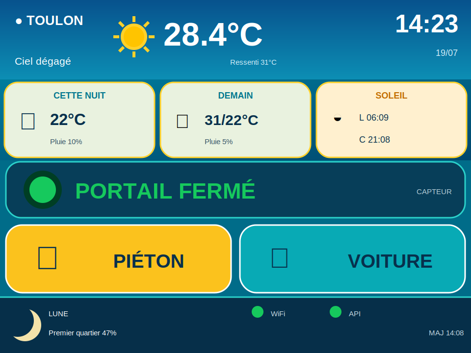

# 08 — CYD Toulon Home

Tableau de bord mural autonome pour le **Cheap Yellow Display ESP32-2432S028R** en orientation paysage 320 × 240. L'accueil privilégie l'état du portail et les deux commandes tactiles ; la météo détaillée est isolée dans une seconde vue.



## Principes

- le CYD ne pilote jamais un relais directement ;
- `PortailControl` reste l'unique contrôleur physique ;
- chaque geste valide envoie au maximum une requête `/pieton` ou `/voiture` ;
- aucune commande physique n'est rejouée, mise en file ou retentée automatiquement ;
- la météo et le portail travaillent sur le cœur réseau, hors de la boucle graphique ;
- la boucle principale ne contient aucun `delay()` ;
- un seul sprite TFT_eSPI 16 bits de 320 × 96 est réutilisé pour toutes les zones.

## Architecture

```text
                         ┌── Open-Meteo HTTPS
WifiManager ─────────────┤
                         └── PortailControl HTTP local
                                  │
WeatherManager ──┐                │ GET /etat (2 s)
PortalClient ────┤                │ GET /pieton
ClockManager ────┤                └ GET /voiture
MoonCalculator ──┼──> DashboardScreen ──> ILI9341
TouchManager ────┤          ▲
AnimationManager ┘          │
                         XPT2046
```

| Classe | Responsabilité |
|---|---|
| `WifiManager` | Connexion et reconnexion Wi-Fi non bloquantes |
| `WeatherManager` | Open-Meteo, parsing filtré et conservation de la dernière valeur valide |
| `PortalClient` | Polling `/etat`, commandes uniques et délai anti-double-appui |
| `ClockManager` | NTP et fuseau Europe/Paris avec heure d'été/hiver |
| `MoonCalculator` | Phase et illumination calculées localement |
| `TouchManager` | Lecture calibrée du XPT2046 et événements tactiles |
| `AnimationManager` | Enfoncement des boutons, retour visuel et respiration du voyant |
| `DashboardScreen` | Rendu partiel des vues accueil et météo avec un sprite partagé |

## Interface 320 × 240

```text
┌ météo actuelle ───────────────────── heure ┐ 42 px
├  ●●  PORTAIL                              ┤
│  ●●  FERMÉ / OUVERT                       │ 92 px
├ PIÉTON ─────────────┬ VOITURE ─────────────┤ 73 px
└ WiFi ● ─ API ● ─────────────── MAJ 14:08 ┘ 33 px
```

Le fond noir, les aplats saturés, les traits épais et les gros caractères restent lisibles sur le TFT à contraste limité. Le voyant rouge respire uniquement après trente secondes d'ouverture. Le texte reste fixe.

Toucher la bande météo ouvre une vue dédiée avec les conditions actuelles, cette nuit, demain, les heures de lever et coucher du Soleil et la phase de la Lune. Après 20 secondes sans interaction, l'accueil revient automatiquement.

## API PortailControl

Adresse par défaut : `http://portail.local`.

| Route | Usage | Politique |
|---|---|---|
| `GET /etat` | `ferme` ou `ouvert`, toutes les 2 s | lecture répétable, timeout 1,8 s |
| `GET /pieton` | impulsion piétonne | une requête, aucun retry |
| `GET /voiture` | impulsion complète | une requête, aucun retry |

Les commandes sont désactivées pendant l'envoi, pendant trois secondes après une commande, sans Wi-Fi ou après deux lectures d'état en échec. Après une commande, une lecture `/etat` est effectuée immédiatement avant la reprise du polling.

`ouvert` signifie uniquement que le capteur ne confirme pas la fermeture. Le CYD affiche volontairement `PORTAIL OUVERT` conformément à l'interface demandée, mais il ne connaît ni le sens du mouvement ni un pourcentage d'ouverture. `/voiture` reste une impulsion pas-à-pas, pas une commande directionnelle garantie.

## Météo

Open-Meteo est interrogé pour Toulon (`43.1242`, `5.9280`, fuseau `Europe/Paris`) toutes les quinze minutes. Le tableau affiche :

- température, description et icône actuels ;
- température représentative, ciel et pluie de 22 h à 6 h ;
- minimum, maximum, ciel et pluie du lendemain ;
- lever et coucher du Soleil ;
- phase et illumination de la Lune, calculées localement.

Après un échec, une tentative de lecture météo est refaite une minute plus tard. La dernière valeur valide reste affichée avec l'indicateur `ANCIENNE`. La connexion HTTPS est chiffrée mais utilise actuellement `setInsecure()`.

## Configuration

Copier `include/config.example.h` vers `include/ToulonHomeConfig.h` :

```cpp
#define WIFI_SSID "MonReseau"
#define WIFI_PASSWORD "MonMotDePasse"
#define PORTAL_BASE_URL "http://portail.local"
#define OTA_PASSWORD "mot-de-passe-local" // facultatif, active l'OTA
```

Supprimer ou commenter `#define DEMO_MODE` pour activer les appels réels. `ToulonHomeConfig.h` est ignoré par Git.

## Mode simulation

Le build par défaut active `DEMO_MODE` et n'envoie aucune requête réseau ou physique.

| `DEMO_SCENARIO` | Cas simulé |
|---:|---|
| 0 | Soleil, portail fermé |
| 1 | Pluie, portail ouvert |
| 2 | Ambiance nuit, portail fermé |
| 3 | API portail indisponible |
| 4 | Wi-Fi perdu et météo ancienne |
| 5 | Portail ouvert pour tester l'alerte après 30 s |

## Compilation et téléversement

```powershell
cd C:\Users\reg42\kDrive\Dev\CheapYellowDisplay_lab\08_CYD_ToulonHome
pio run -e esp32dev_usb
pio run -e esp32dev_usb --target upload
pio device monitor
```

Le moniteur série utilise 115 200 bauds. Aucun téléversement n'est exécuté automatiquement par le projet.

## OTA

Après un premier téléversement USB en mode réel, définir le mot de passe dans l'environnement puis utiliser :

```powershell
$env:CYD_OTA_PASSWORD = "mot-de-passe-local"
pio run -e esp32dev_ota --target upload
```

La cible mDNS est `cyd-toulonhome.local`. L'OTA n'est initialisé qu'en mode réel et uniquement si `OTA_PASSWORD` est défini.

## Bibliothèques

- TFT_eSPI 2.5.43 ;
- ArduinoJson 7.4.3 ;
- WiFi, HTTPClient, WiFiClientSecure et ArduinoOTA du framework ESP32 ;
- XPT2046_Touchscreen 1.4, sous-ensemble ESP32 embarqué sous licence MIT.

## Limites

- l'état du portail est binaire : fermé confirmé ou non fermé ;
- les coordonnées tactiles `200–3800` doivent être validées sur la dalle réelle ;
- le sprite évite le scintillement, mais l'aspect final doit être contrôlé sur l'ILI9341 ;
- les données restent en RAM et disparaissent au redémarrage ;
- HTTPS ne vérifie pas encore le certificat Open-Meteo ;
- l'API PortailControl est en HTTP local sans authentification et ne doit pas être exposée à Internet.
